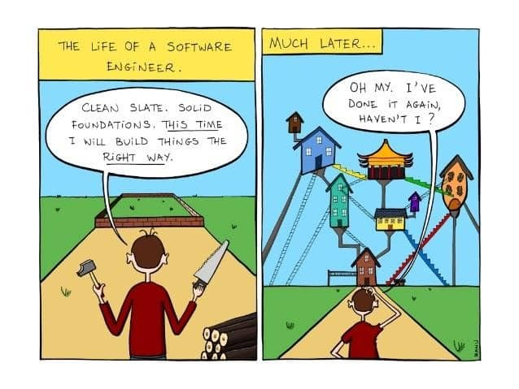

# Blueprints for Software

If you were to set out to build a house, chances are you would first sit down and figure out how you want the house to look. Sure, you could just start building a wall somewhere and see where it goes, but that is probably not the best way to do it. The easier way to do it would be to draw out a plan, and use inspiration from other houses you may have seen and liked.

The same thing can be said for software. If everyone were to start coding without any structure, it would take a really long time to experiment and find out which ideas work well. This is where design patterns come in. Much like blueprints do for a house, design patterns do for software. There are many benefits to this, such as:

- Patterns have been tried and tested, so they work
- Anyone can read the code and easily figure out what is going on
- Reusable code means not having to start over every time

## What Are Some Design Patterns?

### Factory

Used for creating objects that can have hidden dependent objects. This allows for variability in exactly how each object is put together. Each component is like a different type of Lego piece, that can be put together to form objects according to specific needs.

### Singleton

There is exactly one instance of a class, with exactly one door to access it. Think of a large office building with a main entrance. Different people may want to access different offices in the building, but everyone has to walk through the main door past the security desk. This maintains order and manages access, and the building would be chaos otherwise.

### Observer

Once upon a time people watched cable TV, where the station decides what is played when. Observers (people watching TV) are notified of changes in state (a different show or a switch to the news) and can decide when to watch or not watch. A webpage is much the same, since there are many subjects that have changes in state throughout runtime. A button, for example, will notify event listeners when it is clicked, and event listeners can handle the state change accordingly.
