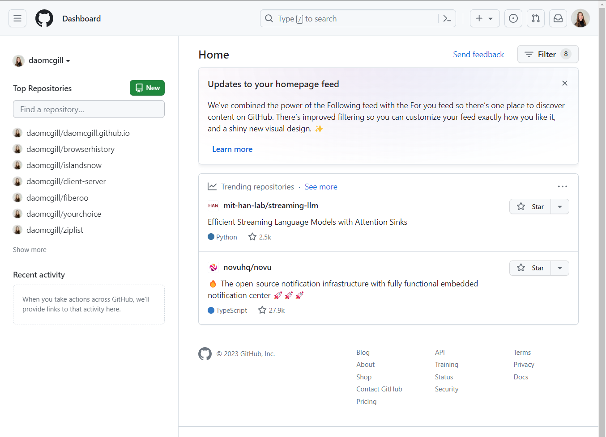
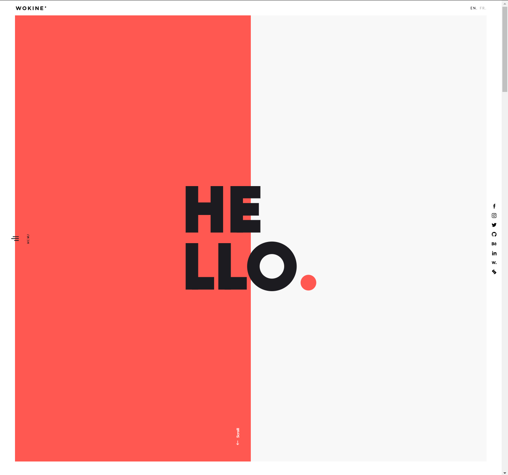
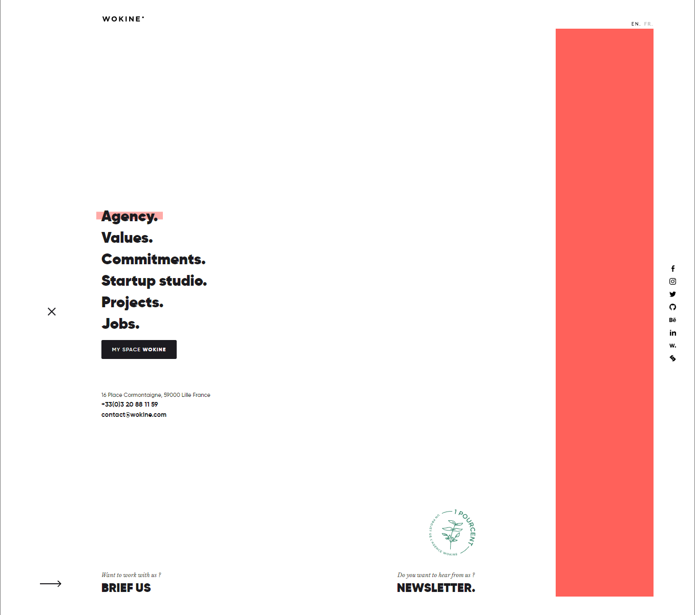

## What Is Bootstrap Again?

Bootstrap is an open-source framework for web development. At its core, Bootstrap offers tools to craft aesthetically pleasing web pages with layouts, buttons, and other elements. Powerhouses like LinkedIn, Spotify, and Twitter owe their slick interfaces to Bootstrap. [Click here to see Bootstrap-enabled websites.](https://stackshare.io/bootstrap) A hallmark of Bootstrap lies in its responsiveness, ensuring pages gracefully adapt from large desktop screens to compact mobile displays.

## The Framework Dilemma: To Use or Not to Use?

For those who are used to using HTML and CSS, the allure of a framework might seem puzzling. There's an inherent learning curve, with new syntaxes often feeling as intricate as learning an entirely new programming language. Mastery, understandably, demands dedication.

But do you *really* need a framework? Not necessarily. The digital universe is replete with websites, including some renowned ones, thriving without frameworks. Take GitHub, for instance—a staple for many developers.
 

Even in its simplicity GitHub encompasses essential UI components like buttons, dropdowns, and search functionalities. However, compare this to a site like [Wokine](https://www.wokine.com/en):

 

The stark difference in aesthetics and interactivity is evident. While achieving such a sophisticated look without frameworks isn't impossible, the challenge and time commitment might be daunting. Bootstrap, despite its intricacies, streamlines the process, enabling developers to craft visually stunning web pages with comparative ease.
