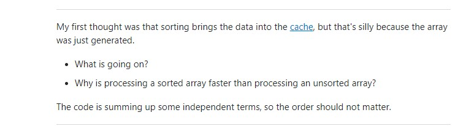

# Asking Smart Questions to Get Answers From Smart People

[How to ask questions the smart way](http://www.catb.org/esr/faqs/smart-questions.html) is a guide on how to ask high quality questions, to get high quality answers. Here is a short summary of the process:

1. Try to find the answer in existing resources (forums, google, manuals, etc.). Keeping a log of what has been learned will make it easier to form a question later.
2. If an answer cannot be found, THEN start considering where the best place to ask the question is. This will likely be a forum dedicated to related topics.
3. Use a useful subject header. The guide recommends the format "object – deviation." People should know what the question is going to be about by reading just the subject line.
4. When writing the question, state what has already been tried (hence the log in step 1). Clearly state the issue and the goal.

That is the basic process, but the guide is an entertaining read that has a lot more pointers, so check it out in the link above.

## An Example of a Smart Question

Here is a question from Stack Overflow about speed of processing a sorted vs unsorted array: [Why is processing a sorted array faster than processing an unsorted array?](https://stackoverflow.com/questions/11227809/why-is-processing-a-sorted-array-faster-than-processing-an-unsorted-array). It may seem like a simple question, but it has been viewed 1.8 million times, and has 25 in-depth expert answers.

### Why this is a good question:

- There is code that clearly shows the problem at hand.
- Comments added for the benefit of the reader.
- Actual time recorded for sorted and unsorted.
- An attempt to solve the problem by using was also posted, showing that the asker had put in work to try to solve it.
- (Below) thought process was explained, and the questions to be answered were stated very clearly.

## And An Example of a Bad Question

This question, on the other hand, has 0 upvotes and one rather confused answer: [Vue slider bar has a bug](https://stackoverflow.com/questions/75479789/vue-slider-bar-has-a-bug).

### What made this a bad question:

- The name is not useful, and goes against the advice of How to ask questions the smart way by stating that a program has a bug.
- A vague description of the issue followed by "it stops working and I'm so confused."
- "Please can you guys help me?" Unsure what they are asking for help about, what they have done to try to fix it, and what the "bug" is.

