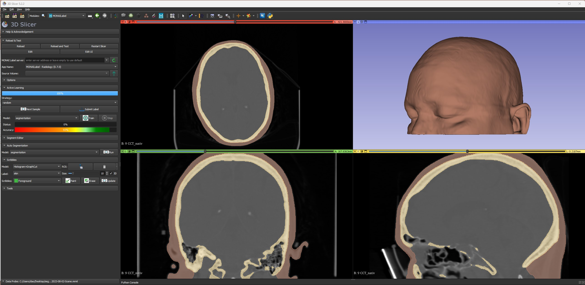

## Project Overview

Medical image segmentation involves the task of dividing scans into distinct regions, enabling the isolation of specific areas of interest. Traditionally, this process demands significant time and effort from radiologists. However, recent advancements in Artificial Intelligence within the field of computer vision have paved the way for automated segmentation models. This project uses two open-source tools:

- [Monailabel](https://github.com/Project-MONAI/MonaiLabel)
- [Slicer3D](https://www.slicer.org/)

The primary objective is to develop a model capable of efficiently segmenting skin in head CT scans, resulting in a rendered skin model. Previously, manual segmentation required hours of meticulous work per scan. With the aid of training data, models can now be generated in under a minute. Challenges encountered include data acquisition without violating patient privacy rights, optimizing model efficiency, and working through the time consuming manual segmentation process.

My role in this project was to set up the Monai Label parameters that are optimal for the training task needed. This involved altering the code and testing the results a number of times. I also developed the segmentation method that is being used for training, anonymized the data according to HIPPA compliance, and am currently working on setting up a server from which other students can upload data for training the model. There were a lot of challenges in this project, and I am still working on it. There is a lot of data required for training accuracy. Once that is completed, I will be testing and validating the models to check for accuracy.

## Future Goals

The project's future trajectory includes the integration of rendered models with live facial tracking technology [Google MediaPipe](https://mediapipe.dev/). This could potentially lead to advancements in surgical procedures down the line. Given the exorbitant costs of medical technology, especially in resource-limited regions, the project emphasizes the value of open-source research as a driver for positive change.

**Note:** This project is ongoing, and a GitHub repository has not yet been established.

