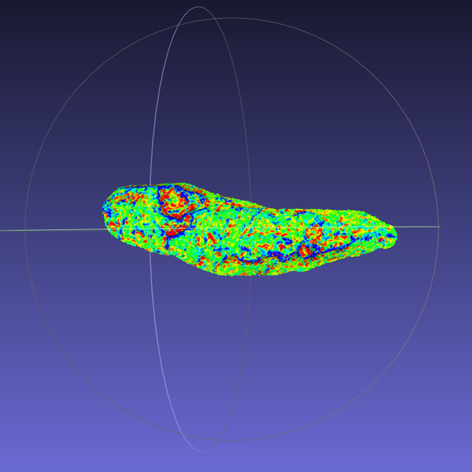
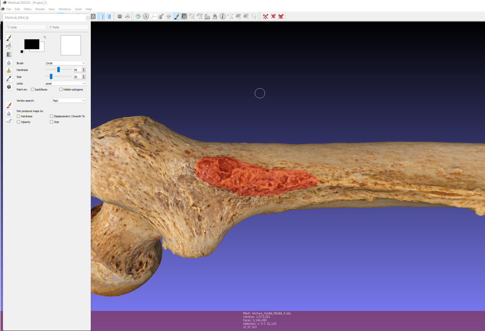
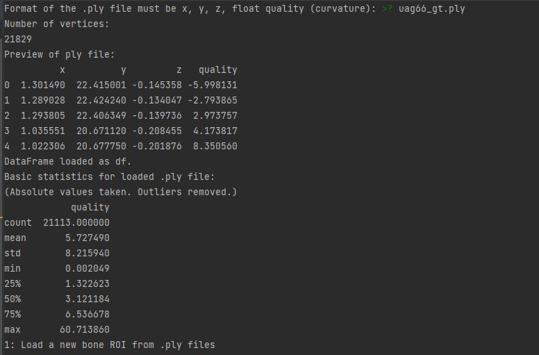

  

## Project Overview

The goal of this project was to accurately measure surface curvature values of 3D meshes, specifically scanned human bones. Previously, the measurement of "robusticity" relied on subjective visual assessment, leading to imprecise values with limited analytical value.

To address this, I developed a system using open-source software for analyzing 3D triangular meshes. By combining the software's output with custom Python code, I was able to provide a comprehensive statistical analysis of the curvature data.

This was the first project I worked on as a student intern, and it taught me a lot. I went into this not knowing much about any part of the process that would be involved, and ended up teaching figuring out how to do each step, one at a time. Another part that was interesting was working with non-CS people, and being primarily responsible for the creation of a solution from start to end.

  

## Project Repository

Find the code and detailed information in the [GitHub repository](https://github.com/daomcgill/meshlab-bone-robusticity).

  

