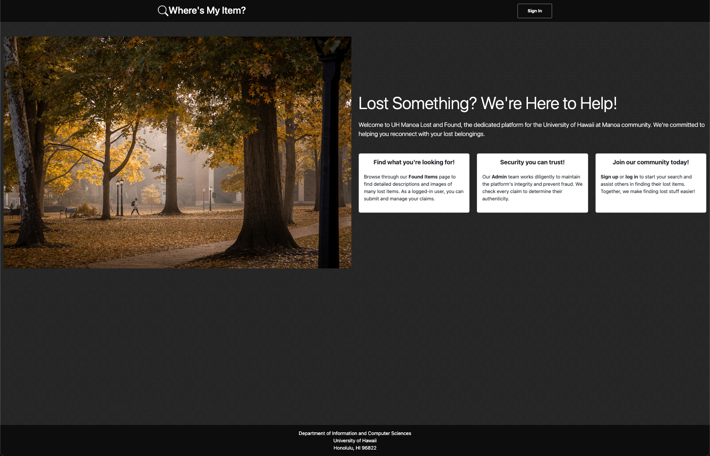

## Project Overview

For a project in my Software Engineering class, I was part of a team that built a site for UH Manoa Lost and Found. The tools we used to achieve this are:

- [React](https://react.dev/)
- [Meteor](https://guide.meteor.com/react)
- [MongoDB](https://www.mongodb.com/)
- [React Bootstrap](https://react-bootstrap.netlify.app/)

The purpose of the site is to allow users to sign up for an account, and use it to browse for items in the lost and found. If the user sees their item, they can fill out a Claim Form, which is sent to the Admin account. The admins can see the claims, and decide what the next steps should be. My team kept track of our tasks by creating issues and organizing them on a GitHub project board. Each member could then assign themselves issues to work on.

## My Role

I worked on several tasks in this project, here are the most notable: 

1. I created the functionality of the Found Items page. This involved creating a Collection in the Mongo database, and specifying the schema for the objects (for example, each object has a category, color, etc.) which would be displayed in the page. I also made an option for the user to filter the items by category, color, or both, along with a Sort button that lets the user flip between Ascending or Descending date posted. Each item has an associated Claim Item button.

2. By following the link to claim an item, the user is brought to a Claim Form. It was a little challenging for me to implement this form, as each form needed to be associated with its correlating item, and an item can have multiple forms. I ended up making a separate Collection for Claims in MongoDB. I then made schema for each Claim so that it would save its item's ID from the URL of the page. This would allow for the Admin page to be able to see which claim went with which item. 

3. I used [Cloudify](https://cloudify.co/) to allow users to optionally upload their images along with their claims. Clicking on upload brings up the user's file explorer, from which they could select their image. At first, I was having trouble when clicking Submit Claim too soon after selecting an image, since the image was not yet uploaded. I solved this by not making the Submit button clickable in the time that an image is being uploaded

## Overall 

In conclusion, the "Where's My Item?" project for the UH Manoa Lost and Found site has been a significant undertaking that effectively involving a range of technologies including React, Meteor, MongoDB, and React Bootstrap. My role in developing the Found Items page, implementing the Claim Form, and integrating Cloudify for image uploads has been both challenging and rewarding. This project not only enhanced my technical skills but also provided valuable insights into working as a team. The experience and knowledge gained from this project will undoubtedly be beneficial in my future endeavors in software engineering.

Find the code and detailed information in the [GitHub repository](https://wheres-my-item.github.io/).